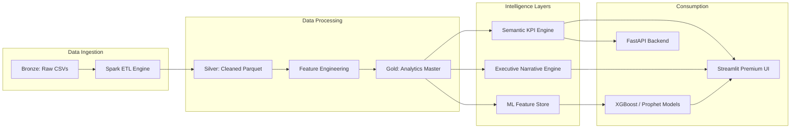

# System Architecture - Enterprise EV Platform

## 🏗️ High-Level Overview

The platform is built on a **Medallion Data Architecture** powered by a simulated **Databricks + Spark** ecosystem. It follows a multi-tier structure designed for scalability, observability, and executive-level business intelligence.

## 📊 Data Flow (Medallion Architecture)

## 🛠️ Technology Stack

- **Data Engineering**: PySpark (ETL), Parquet (Simulated Delta Lake).
- **Analytics Layer**: Pandas, NumPy, Custom KPI Engine.
- **Machine Learning**: XGBoost (Regression), Prophet (Time-Series Forecasting).
- **Backend**: FastAPI (Python).
- **Frontend**: Streamlit (Premium Custom UI).
- **DevOps**: Docker, GitHub Actions (CI/CD).

## 🛡️ Enterprise Engineering Practices

1. **Data Quality Monitoring**: Automated schema validation and health scoring via `services/data_quality.py`.
2. **Semantic Layer**: Centralized business logic in `services/kpi_engine.py` to ensure consistency across UI and API.
3. **MLOps awareness**: Decoupled feature store and modular model training.
4. **Professional UI**: Custom CSS-driven Design System with glassmorphism and modern typography.
