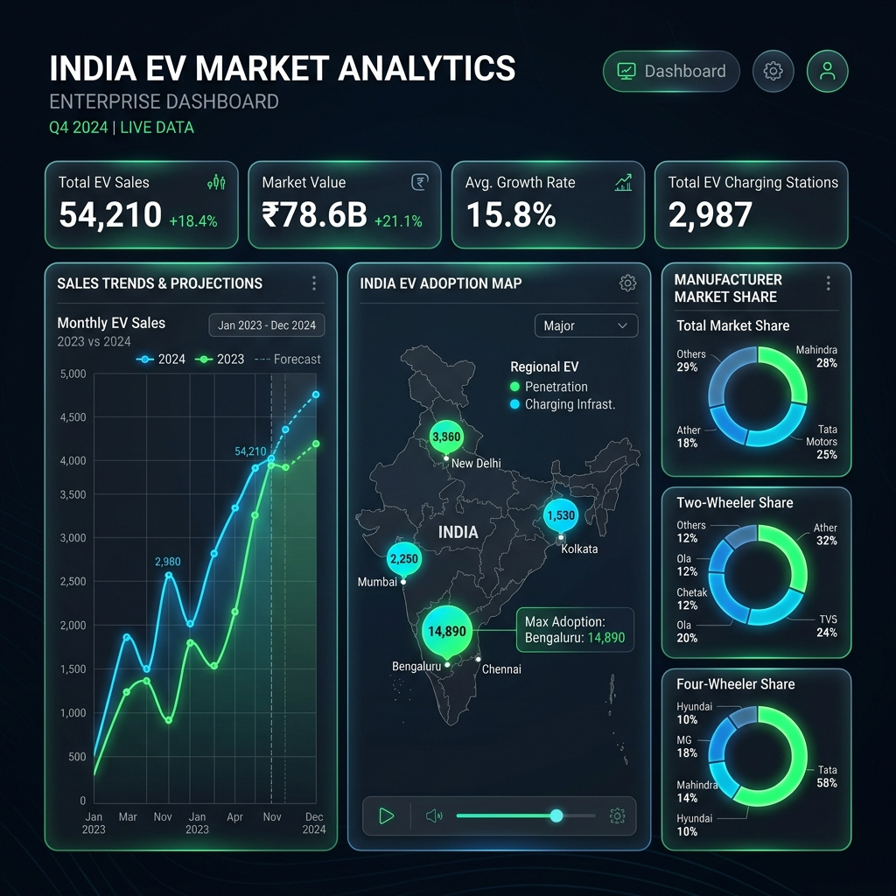
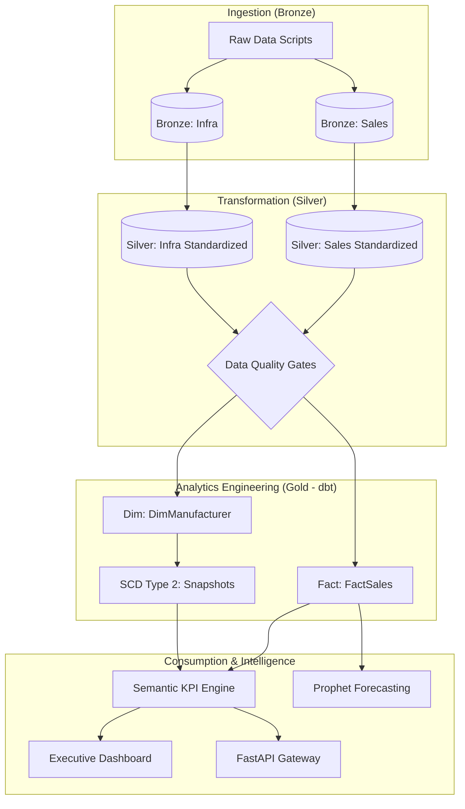

# 🇮🇳 India EV Market Intelligence Platform (Lakehouse + dbt)

## **Overview**


An end-to-end production-grade data engineering and predictive analytics pipeline designed to transform raw Indian EV market data into actionable business intelligence. The platform implements a **Lakehouse Medallion Architecture** to enable scalable processing, historical tracking (SCD Type 2), and AI-driven demand forecasting for executive decision-making.

---

## **Highlights**
*   **End-to-End Pipeline**: Full automation from raw data simulation to high-density executive dashboard.
*   **Lakehouse Architecture**: Medallion logic (Bronze/Silver/Gold) implemented with versioned Parquet storage.
*   **SCD Type 2 Modeling**: Historical tracking of manufacturer metadata using dbt-style snapshot logic.
*   **AI Forecasting**: Integrated Facebook Prophet models for time-series demand projection.
*   **Enterprise UI**: Glassmorphic dark-themed dashboard built with Streamlit and Custom CSS.

---

## **Architecture & Data Flow**

### **The Medallion Workflow**
The platform follows the **Medallion Architecture** pattern, simulating a Delta Lake environment with strictly decoupled layers.



---

## **Dashboard Showcase**

### **1. Executive Dashboard**
*Comprehensive overview of national KPIs, revenue trends (₹ Cr), and market momentum.*


### **2. Location Analytics**
*Geospatial drill-down into state-level adoption vs. charging density benchmarking.*


### **3. Manufacturer Insights**
*OEM market share analysis, pricing vs. volume benchmarks, and revenue modeling.*


### **4. Demand Forecasting**
*AI-powered 12-month projections with confidence intervals for strategic planning.*


---

## **Data Layers**

### **Bronze Layer**
Raw ingestion layer storing source data without transformation, preserving high-fidelity historical state.
*   **Tables**: `bronze.ev_sales`, `bronze.charging_infra`, `bronze.market_benchmarks`.

### **Silver Layer**
Cleaned and structured datasets with unit normalization (₹ Crores) and geographic standardization.
*   **Features**: Null handling, outlier detection, and schema enforcement.

### **Gold Layer (dbt)**
Curated analytical layer built using dbt models for reliable reporting.
*   **Dimension Tables (SCD Type 2)**: Historical tracking of OEM data.
*   **Fact Table**: `FactSales` optimized for multi-dimensional consumption.

---

## **KPI Engine & Analytics**
*   **Total EV Sales**: Absolute volume tracking.
*   **Market Revenue**: Calculated based on segment-weighted transaction prices.
*   **EV Penetration (%)**: Adoption rate relative to vehicle registrations.
*   **Infra Score**: Ratio of charging stations to EV population.

---

## **How to Run**
### 1. Initialize Environment
```bash
pip install -r requirements.txt
```
### 2. Run Data Pipeline
```bash
python scripts/build_pipeline.py
```
### 3. Launch Services
```bash
python -m streamlit run streamlit_app/app.py
python -m uvicorn api.app:app --port 8000
```

---

## **Tech Stack**
| Category | Technology |
| :--- | :--- |
| **Storage** | Delta Lake (Sim), Parquet |
| **ETL** | PySpark, Pandas |
| **Engineering**| dbt (Core) |
| **ML Engine** | Facebook Prophet |
| **API/UI** | FastAPI, Streamlit |

---

## **Business Impact**
*   **Strategic Growth**: Identifies under-penetrated states with high ROI potential.
*   **Revenue Modeling**: Estimates market size for OEM planning and investment.
*   **Operational Efficiency**: Automates E2E reporting, reducing latency from data to insight.
