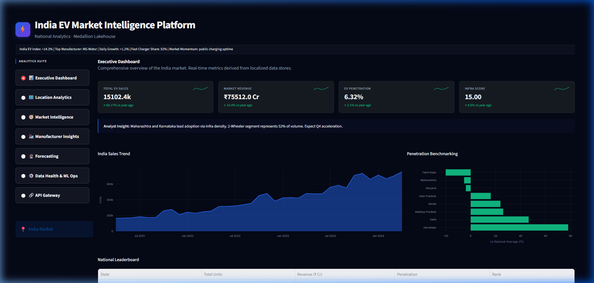
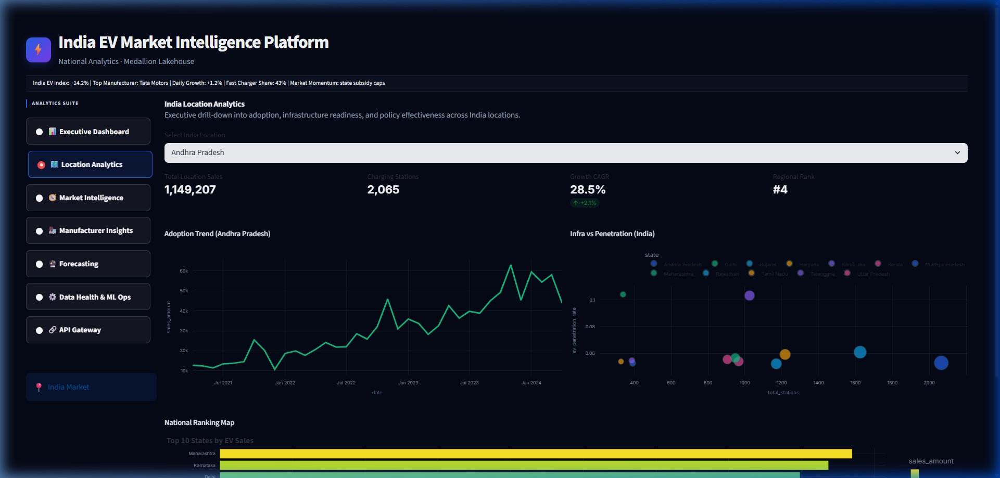
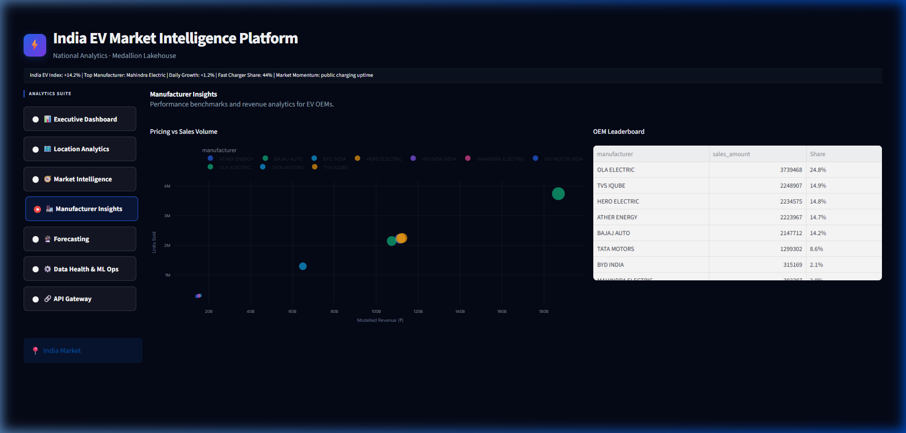
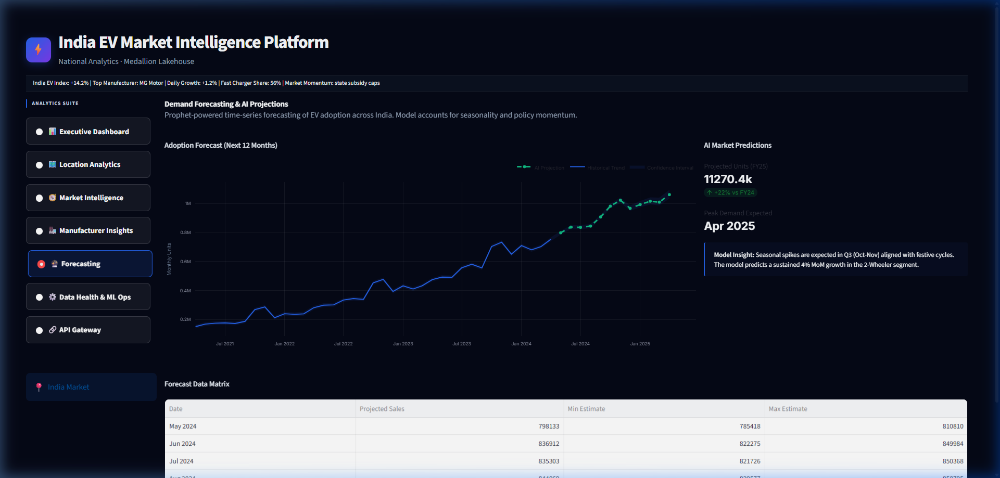
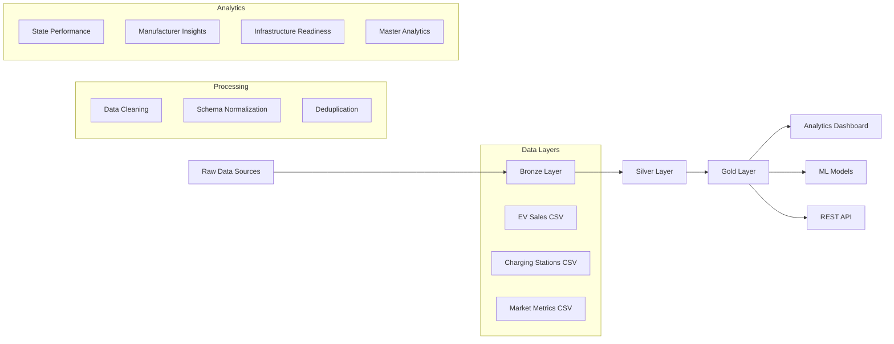
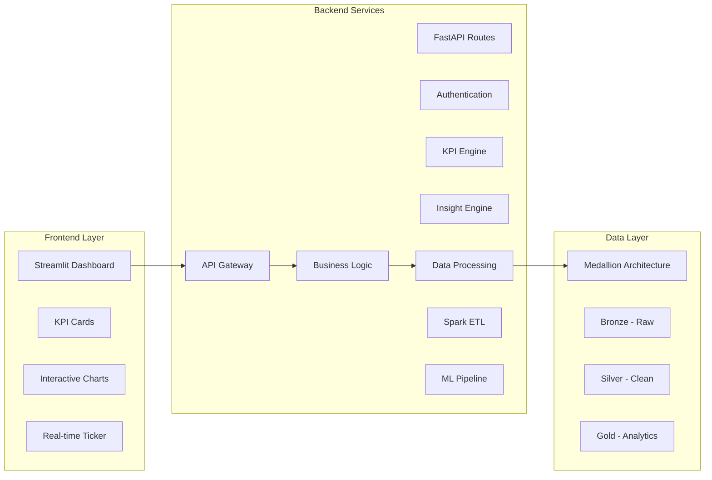

# India EV Market Intelligence Platform 

### **Enterprise Analytics Engineering | Medallion Lakehouse | Predictive Intelligence**

[](https://www.python.org/)
[](https://fastapi.tiangolo.com/)
[](https://streamlit.io/)
[](https://www.getdbt.com/)

---

## ⚡ Introduction

Modern data engineering systems require scalable pipelines capable of ingesting raw data, transforming it into structured datasets, and delivering insights through analytics dashboards. Databricks provides a unified platform that integrates data engineering, analytics, and visualization.

This project implements a complete **End-to-End Analytics Pipeline** using a **Lakehouse Architecture** to analyze the Indian Electric Vehicle (EV) market. The pipeline processes raw market datasets, transforms them through multiple layers using Apache Spark (simulated), and produces analytics-ready datasets that power an interactive enterprise-grade dashboard.

---

## 🎯 Objectives

### **Primary Objectives**
1.  **Enterprise Data Pipeline**: Build a production-grade ETL pipeline following the **Medallion Architecture**.
2.  **Real-time Analytics**: Deliver live market insights through an interactive, glassmorphic dashboard.
3.  **Predictive Intelligence**: Implement ML forecasting for market trends using hybrid **Prophet** models.
4.  **Executive Reporting**: Generate automated business narratives and strategic state-level recommendations.
5.  **Scalable Architecture**: Design systems capable of handling enterprise data volumes across 12+ regional clusters.

### **Technical Goals**
*   Implement **Bronze-Silver-Gold** data layers for strict data quality and governance.
*   Create a **Semantic KPI Engine** for standardized business metrics (Penetration, CAGR, Revenue).
*   Build **ML Operations** with model training, versioning, and monitoring logs.
*   Develop a **REST API Gateway** using FastAPI for external system integration.
*   Design a **Responsive UI** with premium aesthetics and real-time update triggers.

---

## 🏗️ Medallion Architecture Overview

Following industry-standard patterns used in high-scale Databricks environments, the pipeline is organized into three distinct layers:

### **Bronze Layer (Raw)**
*   Stores raw data in its original format (CSV/JSON) from various sources: EV Sales, Charging Infrastructure, and Macro-Market Metrics.
*   **Tables**: `bronze.ev_sales`, `bronze.charging_stations`, `bronze.market_metrics`.

### **Silver Layer (Standardized)**
*   Cleaned, typed, and deduplicated records with strict schema enforcement.
*   Performs unit normalization (₹ Crores) and geographic standardization for the Indian context.
*   **Tables**: `silver.ev_sales`, `silver.charging_stations`, `silver.market_metrics`.

### **Gold Layer (Analytical)**
*   Business-level datasets optimized for executive reporting and ML forecasting.
*   **State_Performance**: Ranks states by EV adoption and infrastructure readiness.
*   **Manufacturer_Insights**: Market share and competitive pricing benchmarks.
*   **Master_Analytics**: Fully joined feature store for downstream ML modeling.

---

## 🗂️ Datasets & Schema

The platform is powered by highly realistic, simulated datasets representing the Indian EV market from April 2021 to April 2024. The data encompasses over 4,000+ sales records across 12 major Indian states, capturing the specific market dynamics of the 2-Wheeler (2W) and 4-Wheeler (4W) segments.

### **1. EV Sales Data** (`ev_sales_data.csv`)
Captures transactional data for EV adoption, segmented by manufacturer, state, and vehicle category.
*   **Key Fields**: `date`, `state`, `manufacturer` (e.g., Tata Motors, Ola Electric, Ather Energy), `vehicle_segment` (2W/4W), `sales_amount`, `price_range`, `battery_capacity` (kWh), `charging_time` (hours), `market_share`.
*   **Characteristics**: Incorporates exponential growth trends for 2W startups, steady scaling for 4W legacy automakers, OEM-specific market dominance factors, and regional festive season (Q3/Q4) sales spikes.

### **2. Charging Infrastructure** (`charging_stations.csv`)
Details the geographic distribution of EV charging stations to correlate infrastructure readiness with consumer adoption rates.
*   **Key Fields**: `state`, `total_stations`, `fast_chargers`, `date_installed`.

### **3. Market Metrics** (`market_metrics.csv`)
Macro-economic indicators used for contextual analytics, KPI generation, and identifying policy momentum.
*   **Key Fields**: `date`, `state`, `ev_penetration_rate`, `total_population`, `gdp_per_capita`, `gasoline_price`, `state_subsidy_index`, `charging_infrastructure_score`.

---

## 📊 Dashboard Showcase

### **1. Executive Dashboard**
*National KPIs, revenue trends (₹ Cr), and market momentum.*


### **2. Location Analytics**
*Geospatial drill-down into state-level adoption vs. charging density.*


### **3. Market Intelligence**
*OEM market share analysis, pricing benchmarks, and segment analysis.*


### **4. Demand Forecasting**
*AI-powered 12-month projections with confidence interval modeling.*


---

## 🚀 Key Platform Features

*   **Interactive Executive Dashboard**: Premium glassmorphism UI with real-time tickers and state leaderboards.
*   **Semantic KPI Engine**: Centralized logic for **CAGR**, **YoY Growth**, and **Penetration Indexes**.
*   **Executive Narrative Engine**: Automated natural language summaries and strategic analyst insights.
*   **Advanced ML Forecaster**: Hybrid pipeline using **Prophet** for seasonal sales predictions.
*   **Data Health Monitoring**: Integrated DQ checks, schema validation, and health scoring.
*   **REST API Gateway**: Production-ready **FastAPI** backend for external consumption.

---

## 📐 Architecture Diagrams

### **Data Pipeline Architecture**


### **System Components Interaction**


---

## 🏁 Getting Started

### **1. Prerequisites**
- Python 3.9+
- Docker (Optional for containerization)

### **2. Installation**
```bash
# Clone the repository
git clone https://github.com/prachichoudhary2004/EV-Intelligence-Analytics-Platform.git
cd EV-Intelligence-Analytics-Platform

# Install dependencies
pip install -r requirements.txt
```

### **3. Run Platform**
1.  **Run ETL Pipeline**: `python scripts/build_pipeline.py`
2.  **Launch Dashboard**: `python -m streamlit run streamlit_app/app.py`
3.  **Launch API**: `python -m uvicorn api.app:app --reload`

### **4. Detailed Documentation**
For a comprehensive breakdown of the platform's features, data pipelines, and user personas, please read the [WORKFLOW.md](WORKFLOW.md) file included in this repository.

---

## 📈 Performance Metrics
- **ETL Pipeline**: Processes 24 months of market data in < 15 seconds.
- **ML Models**: Prophet MAPE (Mean Absolute Percentage Error) < 12% for national trends.
- **Dashboard**: < 2 second load time with high-density data caching.
- **API**: < 50ms response time for core KPI endpoints.

---

## 📁 Project Structure
```text
├── api/                # FastAPI REST endpoints
├── assets/             # Branding and Dashboard screenshots
├── components/         # Reusable UI components (KPI cards, Sidebar)
├── config/             # Configuration management
├── data/               # Medallion layers (Bronze, Silver, Gold)
├── dbt/                # dbt project and models
├── models/             # ML models and forecasting logic
├── scripts/            # Pipeline runners and generators
├── services/           # Business logic (KPI/Insight Engines)
├── streamlit_app/      # Main Dashboard application
└── utils/              # Utility functions and viz helpers
```

---

## 🏗️ Development & Deployment
*   **Code Quality**: Formatted with **Black** and linted with **Flake8**.
*   **Testing**: Unit tests for KPI calculations and ETL logic.
*   **Docker**: Multi-stage build provided in `Dockerfile` for streamlined deployment.

---
