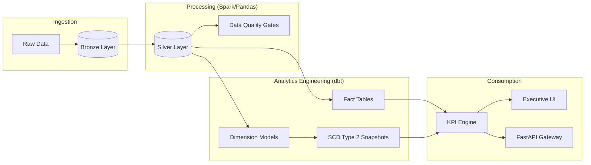

# 🇮🇳 India EV Market Intelligence Platform (Lakehouse + dbt)

## **Overview**


An end-to-end production-grade data engineering and predictive analytics pipeline designed to transform raw Indian EV market data into actionable business intelligence. The platform implements a **Lakehouse Medallion Architecture** to enable scalable processing, historical tracking (SCD Type 2), and AI-driven demand forecasting for executive decision-making.

---

## **Highlights**
*   **End-to-End Pipeline**: Full automation from raw data simulation to high-density executive dashboard.
*   **Lakehouse Architecture**: Medallion logic (Bronze/Silver/Gold) implemented with versioned Parquet storage.
*   **SCD Type 2 Modeling**: Historical tracking of manufacturer metadata using dbt-style snapshot logic.
*   **AI Forecasting**: Integrated Facebook Prophet models for time-series demand projection.
*   **Enterprise UI**: Glassmorphic dark-themed dashboard built with Streamlit and Custom CSS.

---

## **Architecture**
**Flow**: Raw Data → Bronze Layer → Silver Layer → Gold Layer (dbt) → KPI Layer → Dashboard



---

## **Data Layers**

### **Bronze Layer**
The raw ingestion layer storing source data without transformation, preserving high-fidelity historical state.
*   **Tables**:
    *   `bronze.ev_sales`: National and state-level registration logs.
    *   `bronze.charging_infra`: Public and private charger density data.
    *   `bronze.market_benchmarks`: Economic indicators and policy (FAME-II) tracking.

### **Silver Layer**
Cleaned and structured datasets using standardized transformations.
*   **Transformations**:
    *   Schema enforcement and type casting.
    *   Currency normalization (Standardizing to ₹ Crores).
    *   Geographic normalization (State-level mapping).
    *   Null handling and outlier detection.
*   **Tables**:
    *   `silver.ev_sales_standardized`
    *   `silver.charging_infra_standardized`

### **Gold Layer (dbt)**
Curated analytical layer built using dbt models and snapshots for reliable reporting.
*   **Dimension Tables (SCD Type 2)**:
    *   `DimManufacturer`: Historical tracking of OEM market entry and product lines.
    *   `DimState`: Geographic metadata and infrastructure readiness.
*   **Fact Table**:
    *   `FactSales`: Transactional grain for multi-dimensional analysis.
*   **Features**:
    *   Historical tracking using `dbt_valid_from` and `dbt_valid_to`.
    *   Current state filtering via high-watermark timestamps.

---

## **KPI Layer**
Semantic models built to provide reusable and scalable metrics across the platform.
*   **Core Metrics**:
    *   **Total EV Sales**: Absolute volume tracking.
    *   **Market Revenue (₹ Cr)**: Calculated based on segment-weighted transaction prices.
    *   **EV Penetration (%)**: Adoption rate relative to total vehicle registrations.
    *   **Infra Readiness Score**: Ratio of charging stations to EV population.
*   **Dimensional KPIs**:
    *   State-wise adoption growth.
    *   Manufacturer market share (%) and YoY momentum.

---

## **Dashboard**
Executive-level visualizations built to deliver instant market clarity:
*   **Revenue Trends**: Real-time monitoring of market value growth.
*   **Geospatial Benchmarking**: State-level performance heatmaps.
*   **Predictive Projections**: AI-powered 12-month demand forecasting.
*   **OEM Leaderboard**: Competitive analysis of the EV landscape.

---

## **Pipeline Flow**
1.  **Ingestion**: Raw data is ingested into the Bronze layer via automated scripts.
2.  **Standardization**: Spark-based transformations generate the Silver layer with clean schemas.
3.  **Modeling**: dbt builds Gold dimension/fact tables and handles SCD Type 2 logic.
4.  **Forecasting**: The ML engine pulls from the Gold layer to generate Prophet projections.
5.  **Visualization**: Streamlit consumes the KPI layer for real-time reporting.

---

## **How to Run**
### 1. Initialize Environment
```bash
pip install -r requirements.txt
```
### 2. Run Data Pipeline
Processes all layers from Bronze to Gold:
```bash
python scripts/build_pipeline.py
```
### 3. Launch Platform
```bash
# Dashboard
python -m streamlit run streamlit_app/app.py

# API Gateway
python -m uvicorn api.app:app --port 8000
```

---

## **Tech Stack**
| Category | Technology |
| :--- | :--- |
| **Storage/Lakehouse** | Delta Lake (Sim), Parquet |
| **Compute/ETL** | PySpark, Pandas |
| **Analytics Engineering**| dbt (Core) |
| **Forecasting** | Facebook Prophet |
| **API** | FastAPI |
| **UI** | Streamlit, Plotly |

---

## **Business Impact**
*   **Strategic Growth**: Identifies under-penetrated states with high infrastructure potential.
*   **Revenue Optimization**: Enables segment-wise revenue forecasting for OEM planning.
*   **Operational Efficiency**: Automates the E2E data flow, reducing manual reporting latency.
*   **Decision Support**: Provides a single source of truth for Indian EV market intelligence.
