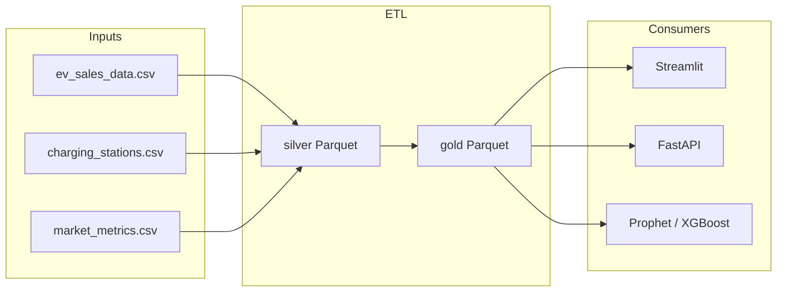

# EV Market Intelligence Analytics

End-to-end **analytics pipeline** and **dashboard** for simulated electric-vehicle (EV) market data: medallion-style layers (bronze → silver → gold), a **Streamlit** executive UI, a **FastAPI** service, and **forecasting** with Prophet (and optional XGBoost training).

The design is **inspired by lakehouse / Databricks-style layering**; this repository runs **locally** with Python, CSV/Parquet on disk, and optional PySpark if installed.

---

## Features

- **ETL**: Bronze CSV ingestion, silver cleansing, gold aggregates (`state_performance`, `manufacturer`, `infrastructure`, `master_analytics`) plus a Parquet feature store
- **Dashboard**: Streamlit app with KPIs, Plotly charts, narrative summaries, and multi-page analytics
- **API**: JSON endpoints for market KPIs, state benchmarks, and Prophet forecasts
- **ML**: `models/forecaster.py` — Prophet for time-series forecasts; XGBoost training helper for tabular experiments
- **Quality**: Data-quality scoring on key datasets via `services/data_quality.py`

---

## Tech stack

| Area | Tools |
|------|--------|
| Data | Pandas, Parquet (PyArrow); optional PySpark |
| API | FastAPI, Uvicorn |
| UI | Streamlit, Plotly |
| ML | Prophet, XGBoost, scikit-learn |
| Config | `python-dotenv`, `config/config.py` |

---

## Prerequisites

- **Python 3.10+** recommended (3.9+ may work; Prophet/cmdstan can be sensitive to environment)
- **Git**

Optional: **Docker** if you use the bundled `Dockerfile` / `docker-compose.yml`.

---

## Quick start

```bash
git clone <your-repo-url>
cd ev-intelligence-analytics

python -m venv .venv
# Windows: .venv\Scripts\activate
# macOS/Linux: source .venv/bin/activate

pip install -r requirements.txt
```

### 1. Run ETL (builds silver, gold, and feature store)

From the **repository root**:

```bash
python services/spark_engine.py
```

Outputs include:

- `data/silver/*.parquet`
- `data/gold/*.parquet`
- `feature_store/sales_features.parquet`

### 2. Launch the dashboard

```bash
python -m streamlit run streamlit_app/app.py
```

Open **http://localhost:8501**.

On Windows, if `streamlit` alone is not found on `PATH`, use **`python -m streamlit`** as above.

### 3. Launch the API

```bash
python -m uvicorn api.app:app --host 127.0.0.1 --port 8000 --reload
```

Open **http://127.0.0.1:8000/docs** for interactive API docs.

---

## API (summary)

| Method | Path | Description |
|--------|------|-------------|
| `GET` | `/` | Health / welcome |
| `GET` | `/kpis/market` | Aggregated market KPIs from gold master table |
| `GET` | `/analytics/benchmarks` | State vs national penetration benchmarks |
| `GET` | `/forecast/prophet?periods=12` | Prophet forecast (requires gold data; Prophet installed) |

---

## Repository layout

```
ev-intelligence-analytics/
├── api/                 # FastAPI application
├── assets/              # Static CSS for Streamlit
├── components/          # Streamlit UI components
├── config/              # Paths and settings
├── data/
│   ├── bronze/          # Raw CSV inputs
│   ├── silver/          # Cleaned Parquet (ETL output)
│   └── gold/            # Analytics Parquet (ETL output)
├── design_system/       # Theme / styling helpers
├── feature_store/       # Feature Parquet (ETL output)
├── models/              # Forecasting / ML helpers
├── notebooks/           # Optional exploratory notebooks
├── services/            # ETL, KPI, insights, streaming, DQ, etc.
├── streamlit_app/       # Main app + pages
├── utils/               # Logging and utilities
├── Dockerfile
├── docker-compose.yml
└── requirements.txt
```

---

## Optional: Docker

If Docker is available:

```bash
docker compose up --build
```

Adjust ports and commands in `docker-compose.yml` to match how you expose Streamlit and Uvicorn.

---

## Documentation in repo

- [ARCHITECTURE.md](ARCHITECTURE.md) — architecture notes  
- [SYSTEM_DESIGN.md](SYSTEM_DESIGN.md) — system design  
- [ROADMAP.md](ROADMAP.md) — roadmap  

---

## Optional dev tooling

```bash
black .
flake8 .
```

There is no bundled `tests/` directory in this repository; add your own checks or CI as needed.

---

## Data flow (high level)



---

## Acknowledgments

- Medallion / lakehouse ideas popularized in modern data platforms (including Databricks-style references in learning materials)
- Built with open-source Python tooling: Pandas, Streamlit, FastAPI, Prophet, XGBoost
