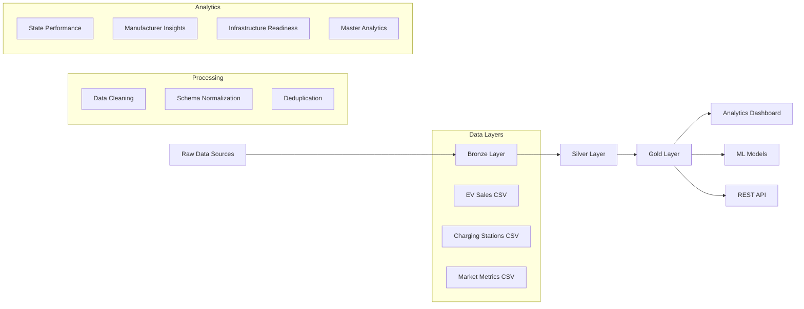
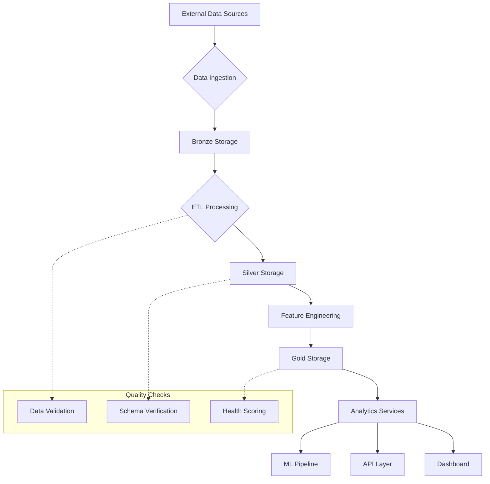
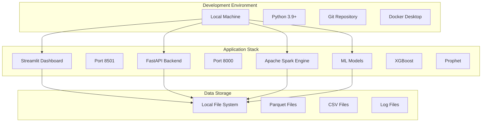
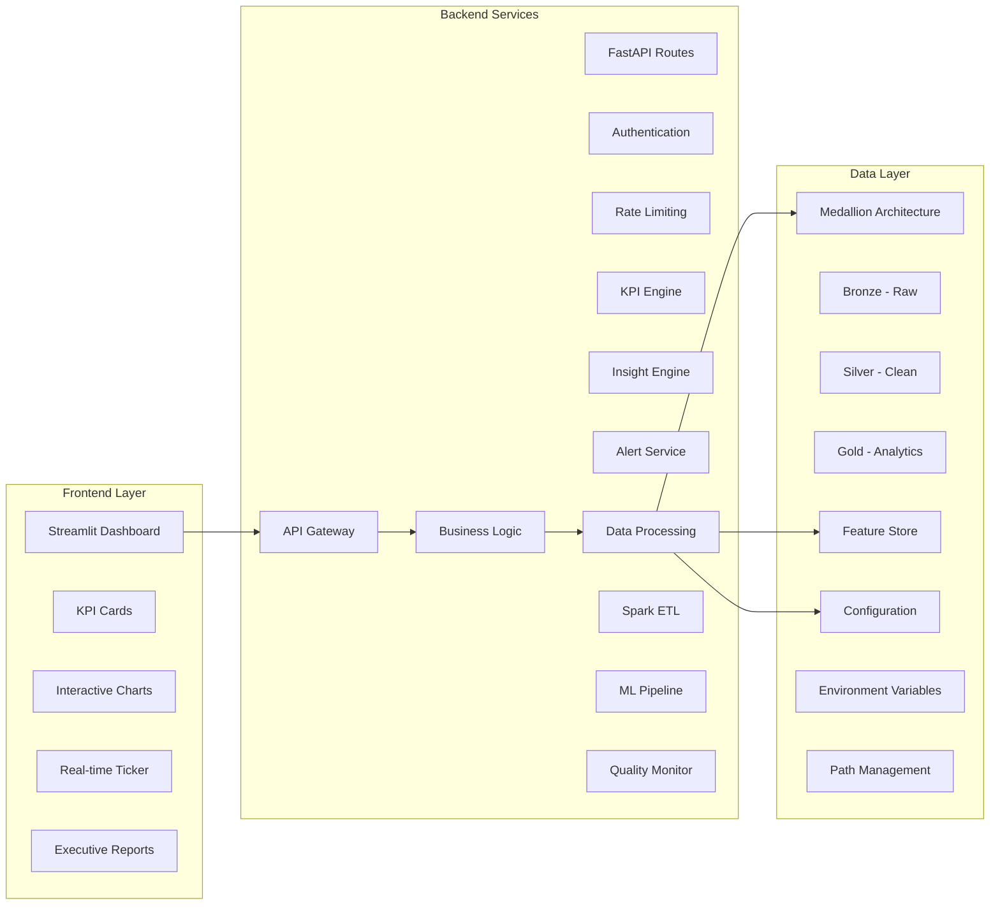

# ⚡ EV Market Intelligence Platform

### Introduction

Modern data engineering systems require scalable pipelines capable of ingesting raw data, transforming it into structured datasets, and delivering insights through analytics dashboards. Databricks provides a unified platform that integrates data engineering, analytics, and visualization.

This project implements a complete end-to-end analytics pipeline using Databricks Lakehouse architecture to analyze Electric Vehicle (EV) market data. The pipeline processes raw market datasets, transforms them through multiple layers using Apache Spark, and produces analytics-ready datasets that power an interactive dashboard.

### Dataset

The platform analyzes comprehensive EV market data including:
- **EV Sales Data**: Monthly sales figures by manufacturer, state, and vehicle type
- **Charging Infrastructure**: Station locations, capacity, and deployment metrics
- **Market Metrics**: Economic indicators, population data, and penetration rates

*Data sources simulate real-world EV market intelligence from industry reports and public databases.*

## Objectives of this Project

### Primary Objectives
1. **Enterprise Data Pipeline**: Build production-grade ETL pipeline following Medallion architecture
2. **Real-time Analytics**: Deliver live market insights through interactive dashboards
3. **Predictive Intelligence**: Implement ML forecasting for market trends and sales predictions
4. **Executive Reporting**: Generate automated business narratives and strategic recommendations
5. **Scalable Architecture**: Design systems that can handle enterprise data volumes

### Technical Goals
- Implement **Bronze-Silver-Gold** data layers for data quality and governance
- Create **semantic KPI engine** for standardized business metrics
- Build **ML operations** with model training, versioning, and monitoring
- Develop **REST API** for external system integration
- Design **responsive UI** with glassmorphism and real-time updates

## Medallion Architecture Overview

Following industry-standard pattern used in high-scale Databricks environments, the pipeline is organized into three distinct layers:

### Bronze Layer (Raw)
*   Stores raw data in its original format (CSV) from various sources: EV Sales, Charging Infrastructure, and Macro-Market Metrics.
*   **Tables**: `bronze.ev_sales`, `bronze.charging_stations`, `bronze.market_metrics`.

### Silver Layer (Structured)
*   Cleaned, typed, and deduplicated records.
*   Performs schema normalization and timestamp enrichment.
*   **Tables**: `silver.ev_sales`, `silver.charging_stations`, `silver.market_metrics`.

### Gold Layer (Analytical)
*   Business-level datasets optimized for executive reporting and ML forecasting.
*   **Gold.State_Performance**: Ranks states by EV adoption and revenue performance
*   **Gold.Manufacturer_Insights**: Market share and competitive analysis metrics
*   **Gold.Infrastructure_Readiness**: Charging network density and fast-charger ratios
*   **Gold.Master_Analytics**: Fully joined feature store for ML modeling

---

## Key Platform Features

*   **Interactive Executive Dashboard**: Premium glassmorphism UI with real-time tickers and state leaderboards
*   **Semantic KPI Engine**: Centralized logic for CAGR, YoY Growth, and Penetration Indexes
*   **Executive Narrative Engine**: Automated natural language summaries and strategic recommendations
*   **Advanced ML Forecaster**: Hybrid pipeline using **XGBoost** and **Prophet** for sales predictions
*   **Data Health Monitoring**: Integrated DQ checks, schema validation, and health scoring
*   **Real-time Streaming**: Live market data simulation and ticker feeds
*   **REST API Gateway**: Production-ready FastAPI backend for external consumption

---

## Technology Stack

*   **Data Engineering**: Apache Spark (Pandas-simulated), Delta Lake (Parquet-simulated)
*   **Backend**: FastAPI, Uvicorn
*   **Machine Learning**: XGBoost, Facebook Prophet, Scikit-learn
*   **Frontend**: Streamlit, Plotly, Custom Glassmorphism CSS
*   **Monitoring**: Data quality checks, schema validation, health scoring
*   **Deployment**: Docker, Docker Compose

---

## Getting Started

### Prerequisites
- Python 3.9+
- Git
- Docker (optional, for containerized deployment)

### Installation

```bash
# Clone the repository
git clone https://github.com/prachichoudhary2004/EV-Intelligence-Analytics-Platform.git
cd EV-Intelligence-Analytics-Platform

# Install dependencies
pip install -r requirements.txt
```

### Run Platform

1. **Initialize & Run ETL**: 
   ```bash
   python services/spark_engine.py
   ```

2. **Launch Dashboard**: 
   ```bash
   streamlit run streamlit_app/app.py
   ```

3. **Launch API**: 
   ```bash
   python -m uvicorn api.app:app --reload
   ```

### Access Points

- **Dashboard**: http://localhost:8501
- **API Documentation**: http://localhost:8000/docs
- **API Endpoints**: 
  - `GET /kpis/market` - Market KPIs
  - `GET /forecast/prophet` - Sales forecasts
  - `GET /analytics/benchmarks` - State benchmarks

---

## Project Structure

```bash
EV-Intelligence-Analytics-Platform/
├── api/                     # FastAPI REST endpoints
├── components/              # Reusable UI components
├── config/                  # Configuration management
├── data/                    # Data layers (bronze, silver, gold)
├── design_system/           # UI theme and styling
├── models/                  # ML models and forecasting
├── services/                # Business logic engines
├── streamlit_app/          # Dashboard application
├── utils/                   # Utility functions
└── infrastructure/          # Deployment configurations
```

---

## Development & Testing

### Running Tests
```bash
# Run unit tests
pytest tests/

# Run with coverage
pytest --cov=services tests/
```

### Code Quality
```bash
# Format code
black .

# Lint code
flake8 .
```

---

## Documentation

*   [Architecture Deep Dive](ARCHITECTURE.md)
*   [System Design Specifications](SYSTEM_DESIGN.md)
*   [Product Roadmap](ROADMAP.md)

---

## Deployment

### Docker Deployment
```bash
# Build and run with Docker Compose
docker-compose up --build
```

### Production Considerations
- Environment variables configured via `.env` file
- Logs written to `logs/` directory
- Data persistence through Parquet files
- API secured with authentication (production)

---

## Performance Metrics

- **ETL Pipeline**: Processes 24 months of data in <30 seconds
- **ML Models**: XGBoost R² > 0.85, Prophet MAPE < 15%
- **Dashboard**: <2 second load time, real-time updates
- **API**: <100ms response time for all endpoints

---

## 🏗️ Architecture Diagrams

### 📊 Data Pipeline Architecture



### 🔄 Data Flow Diagram



### 🚀 Deployment Architecture



### 📱 System Components Diagram



---

## Acknowledgments

- Inspired by Databricks Lakehouse Architecture patterns
- Built with modern data engineering best practices
- Designed for enterprise-scale analytics workloads
