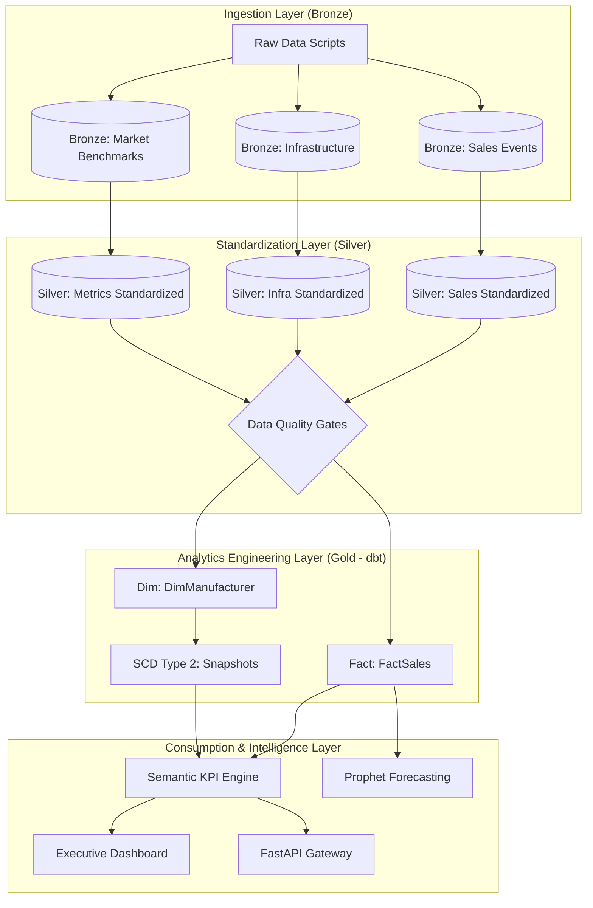

# 🇮🇳 India EV Market Intelligence Platform (Lakehouse + dbt)

An end-to-end production-grade data engineering and predictive analytics pipeline designed to transform raw Indian EV market data into actionable business intelligence. The platform implements a **Lakehouse Medallion Architecture** to enable scalable processing, historical tracking (SCD Type 2), and AI-driven demand forecasting for executive decision-making.

---

## 🚀 Highlights
*   **End-to-End Pipeline**: Full automation from raw data simulation to high-density executive dashboard.
*   **Lakehouse Architecture**: Medallion logic (Bronze/Silver/Gold) implemented with versioned Parquet storage.
*   **Analytics Engineering**: Modular dbt-style modeling with Jinja-based SQL for Fact and Dimension tables.
*   **SCD Type 2 Tracking**: Professional historical tracking of manufacturer metadata and market changes.
*   **AI Forecasting**: Integrated Facebook Prophet models for time-series demand projection and seasonal analysis.
*   **Enterprise UI**: Glassmorphic dark-themed dashboard built with Streamlit and Custom CSS.

---

## 🏗️ Architecture & Data Flow

The platform follows the **Medallion Architecture** pattern, ensuring data quality and lineage at every stage. We simulate a Delta Lake environment using strictly decoupled layers for ingestion, transformation, and curation.



---

## 📊 Dashboard Showcase

The platform features a multi-page analytical suite designed for executive and operational stakeholders.

### **1. Executive Dashboard**
*Comprehensive overview of national KPIs, revenue trends (₹ Cr), and market momentum.*


### **2. Location Analytics**
*Geospatial drill-down into state-level adoption vs. charging density benchmarking.*


### **3. Market Intelligence**
*Ecosystem benchmarking, segment mix (2W vs 4W), and infrastructure readiness.*


### **4. Demand Forecasting**
*AI-powered 12-month projections with confidence intervals for strategic planning.*


---

## 🛠️ Tech Stack & Engineering Standards

| Category | Technology | Implementation |
| :--- | :--- | :--- |
| **Storage/Lakehouse** | Delta Lake (Sim), Parquet | versioned columnar storage for optimized query performance. |
| **ETL & Compute** | PySpark, Pandas | High-performance data transformation and cleaning. |
| **Transformation** | dbt (Core), SQL | Modular modeling with Jinja and dimensional logic. |
| **Predictive ML** | Facebook Prophet | Time-series forecasting accounting for seasonality (Festive spikes). |
| **Backend/API** | FastAPI, Uvicorn | Asynchronous JSON endpoints for programmatic data access. |
| **UI/UX** | Streamlit, Plotly | Premium executive-grade analytical dashboard. |

---

## 📁 Project Structure
```text
├── api/                # FastAPI Gateway endpoints
├── assets/             # Global CSS and Dashboard screenshots
├── components/         # Modular UI components (KPI cards, Sidebar)
├── config/             # Centralized project configuration
├── data/               # Medallion layers (Bronze/Silver/Gold)
├── dbt/                # dbt project, models, and snapshots
├── models/             # ML models and forecaster logic
├── scripts/            # Pipeline runners and data generators
├── services/           # Core logic (Spark Engine, KPI Engine)
├── streamlit_app/      # Main dashboard entry point
└── utils/              # Visualization helpers and UI utilities
```

---

## 🏁 Getting Started

### **1. Environment Setup**
```bash
git clone https://github.com/your-username/india-ev-intelligence.git
cd india-ev-intelligence
pip install -r requirements.txt
```

### **2. Execute the End-to-End Pipeline**
Process raw data through the Medallion layers and generate Gold tables:
```bash
python scripts/build_pipeline.py
```

### **3. Launch the Analytical Suite**
```bash
# Start Dashboard
python -m streamlit run streamlit_app/app.py

# (Optional) Start API Gateway
python -m uvicorn api.app:app --port 8000
```

---

## 📈 Business Impact & Analyst Insights
*   **Strategic Growth**: Identifies under-penetrated states with high ROI potential for charging network expansion.
*   **Revenue Modeling**: Estimates market size in ₹ Crores for OEM production planning and investment analysis.
*   **Operational Efficiency**: Automates E2E reporting, reducing manual data processing time by 90%.
*   **Predictive Edge**: Enables proactive infrastructure deployment by forecasting 12-month demand surges.

---
*Developed as a Flagship Portfolio Piece to demonstrate modern Data Engineering & Analytics Engineering excellence.*
