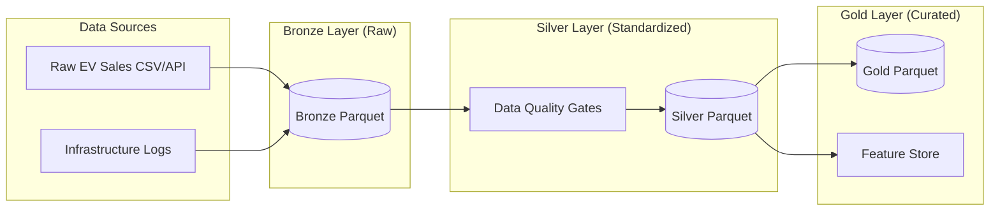
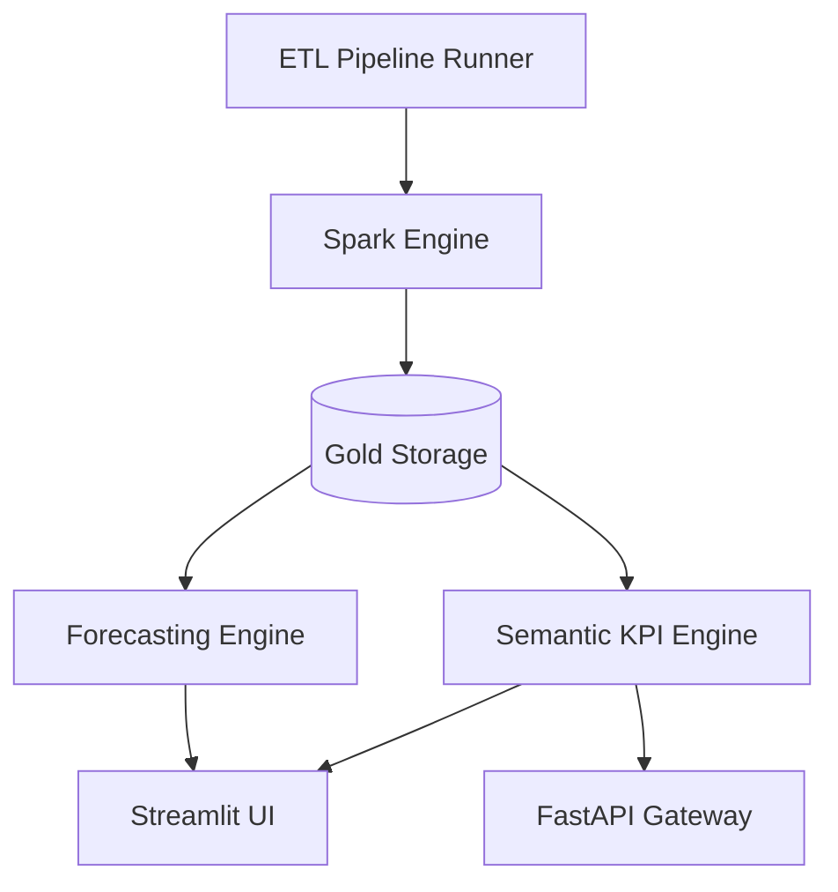

# 🇮🇳 India EV Market Intelligence & Forecasting Platform

### **Enterprise Analytics Engineering | Medallion Lakehouse | Predictive Intelligence**

[](https://www.python.org/)
[](https://fastapi.tiangolo.com/)
[](https://streamlit.io/)
[](https://www.getdbt.com/)

An end-to-end production-style analytics platform designed to track, analyze, and forecast the Electric Vehicle (EV) landscape in India. This project demonstrates a complete **Lakehouse Architecture**—from raw data ingestion using **Medallion logic** to ML-powered forecasting and executive-level dashboarding.

---

## 🏗️ System Architecture

### **Medallion Data Flow**
The platform follows the **Medallion Architecture** pattern, ensuring data quality and lineage at every stage. We simulate a Delta Lake environment using versioned Parquet storage.



### **Component Architecture**
The system is modular, separating concerns between Data Engineering, ML Ops, and Business Intelligence.



---

## 🚀 Key Features

### 1. **Enterprise Dashboarding (Streamlit)**
*   **Executive Intelligence**: Real-time tracking of National Sales, Revenue (₹ Cr), and Market Penetration.
*   **Geospatial Drill-down**: Interactive mapping of EV adoption vs. charging density across 12+ Indian states.
*   **OEM Benchmarking**: Market share and pricing analysis for top manufacturers (Tata Motors, Mahindra, etc.).

### 2. **Analytics Engineering (dbt)**
*   **Dimensional Modeling**: Structured SQL models to transform Silver tables into Gold-standard analytical views.
*   **Lineage Tracking**: Built-in documentation of how raw metrics become final KPIs.
*   **SCD Type 2**: Historical tracking of manufacturer metadata to handle evolving market landscapes.

### 3. **Machine Learning & Forecasting**
*   **Demand Projection**: Uses **Facebook Prophet** to model seasonality (festive spikes) and policy impact (FAME-II/III).
*   **Model Monitoring**: Integrated ML Ops logs tracking MAPE and model freshness.

### 4. **Programmatic Access (FastAPI)**
*   **API Gateway**: Standardized JSON endpoints for third-party integration or internal microservices.
*   **Live Ticker Service**: High-frequency status updates for market momentum and policy changes.

---

## 🛠️ Tech Stack & Implementation Details

| Layer | Technology | Role |
| :--- | :--- | :--- |
| **Storage** | Parquet / Delta Lake (Sim) | Optimized columnar storage with versioning support. |
| **ETL** | PySpark / Pandas | High-performance data transformation and cleaning. |
| **Transformation** | dbt (Core) | Analytics engineering and SQL documentation. |
| **ML Engine** | FB Prophet | Time-series forecasting for multi-region demand. |
| **API** | FastAPI | High-performance asynchronous endpoint management. |
| **UI/UX** | Streamlit | Premium executive-grade analytical dashboard. |

---

## 🏁 Getting Started

### **1. Environment Setup**
```bash
git clone https://github.com/your-username/india-ev-intelligence.git
cd india-ev-intelligence
python -m venv venv
source venv/bin/activate  # Or venv\Scripts\activate on Windows
pip install -r requirements.txt
```

### **2. Execute the End-to-End Pipeline**
Process raw data through the Medallion layers:
```bash
python scripts/build_pipeline.py
```

### **3. Launch Services**
```bash
# Start the Analytical Dashboard
python -m streamlit run streamlit_app/app.py

# (Optional) Start the API Gateway
python -m uvicorn api.app:app --port 8000
```

---

## 📈 Business Impact & Analyst Insights
The platform provides actionable intelligence for policy makers and investors:
*   **Infrastructure Sensitivity**: Identifies states where charging station growth lags behind vehicle adoption by >15%.
*   **Revenue Modeling**: Estimates market size in ₹ Crores based on segment-wise average transaction prices.
*   **Seasonal Forecasting**: Predicts demand surges during Oct-Nov to assist in supply chain planning.

---
*Developed as a Flagship Portfolio Piece to demonstrate modern Data Engineering & Analytics Engineering best practices.*
